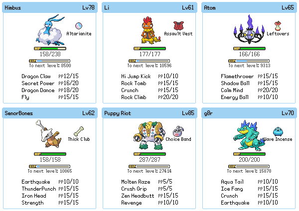
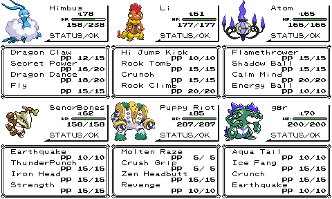

# Dew Party Display

This is a tool to show real-time updates to a party when playing a Pokémon game with the [Dew](https://github.com/screenshakes/Dew) Discord bot.

A preview of some of the themes:

### Gaia

### Gen 1

### Gen 2

---

## Setup

This tool requires the use of Pillow. You can install it however you want, but I recommend the use of a virtualenv or similar. Run assets.py to unzip the sprites to the correct directories. Copy config-example.ini to config.ini and set the options and paths as appropriate. After that, run readmons.py to generate the image.

Serving the image with Dew is a bit more involved, and you may want to tailor this to your exact setup. You can modify it to post the image directly to the channel, or have the image served from a web server and have it post the link instead.